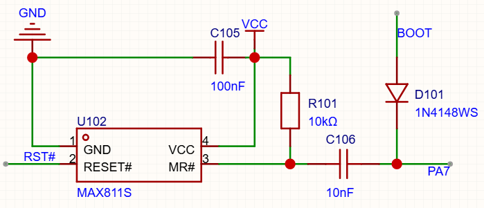
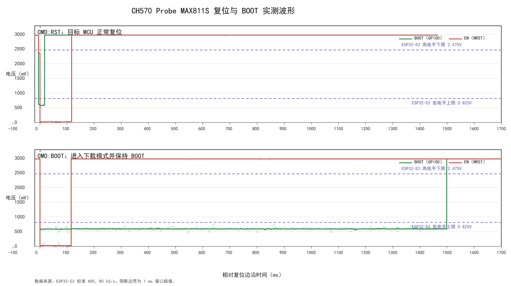

# PA7、BOOT 与 MAX811S 复位电路原理

本文说明 Probe 上用于控制下游 MCU `BOOT` 和 `EN/NRST` 的实际电路、MAX811S 的规格行为、PA7 各种状态下的节点变化，以及 ESP32-C3 示波器的最新实测结果。

## 1. 当前电路连接

当前原理图的简化关系如下：


关键连接关系：

| 器件/节点 | 连接关系 | 作用 |
|---|---|---|
| U102 MAX811S pin 1 `GND` | 系统地 | 芯片参考地 |
| U102 pin 4 `VCC` | 经 D102 SS14 后的 VCC 电源 | 复位监控电源，不应直接等同于 LDO_VCC |
| U102 pin 2 `RESET#` | 下游 MCU `EN/NRST` | 低有效复位输出 |
| U102 pin 3 `MR#` | R101、C106 汇合节点 | 低有效手动复位输入 |
| R101 | `VCC` 到 `MR#`，10kΩ | 将 `MR#` 拉回高电平 |
| C106 | `MR#` 到 Probe `PA7`，10nF | 只耦合 PA7 的电压变化边沿 |
| D101 | 下游 `BOOT` 与 PA7，1N4148WS | PA7 为低时把 BOOT 拉低；PA7 为高/高阻时释放 BOOT |
| C105 | `VCC` 到 `GND`，100nF | MAX811S 电源去耦 |

因此，PA7 并没有直流连接到 `MR#`。C106 是串联耦合电容，R101 决定 `MR#` 的直流工作点；PA7 的低电平主要通过 D101 作用于 BOOT，同时通过 C106 在 `MR#` 产生一个短暂的边沿脉冲。

### 下游 BOOT 按键不会干扰 MAX811S 的原因

下游用户按下 `BOOT` 按键时，按键只会把 `BOOT` 节点拉到地。D101 的阳极在 BOOT 侧、阴极在 PA7 侧：PA7 被拉低时，BOOT 上拉电阻提供的电流经 D101 流入 PA7，因而 BOOT 被拉低；反过来，用户把 BOOT 拉低时，D101 的阳极为低、PA7 侧保持高电平或高阻，二极管反向偏置或截止，BOOT 的下降沿没有导通路径传到 PA7。

这也是它不干扰 MAX811S 的关键：C106 只会把 PA7 的电压边沿耦合至 `MR#`，而不是直接连接 BOOT。按下 BOOT 时，D101 截止，PA7 不会被 BOOT 按键拉低，因此 `MR#` 不会得到触发复位所需的负脉冲；按键松开后，即使 BOOT 经上拉恢复并通过 D101 对高阻 PA7 产生很小的影响，其方向也是正向跃迁，只会使 `MR#` 偏向高电平，不能触发低有效的 MAX811S `MR#`。`MR#` 的直流工作点始终由 R101 拉至 `VCC`。

该隔离结论依赖 D101 极性正确且 C106、R101 均按当前原理图连接；若 D101 装反、短路或 PA7 被外部强驱动到异常电平，则不再成立。

## 2. MAX811S 规格行为

### 2.1 最新网表中的供电链与信号连接

最新网表给出的电源连接为：

```text
USB VBUS_IN -> U101 NH6375A33P LDO -> LDO_VCC
LDO_VCC -> D102 SS14 -> VCC -> CH570Q VDD33/VIO33、U102 MAX811S VCC
MCU_VCC -> D103 SS14 -> VCC（外部 MCU 供电隔离/防反灌）
```

SS14 的阳极在上游、阴极在 `VCC`，正向供电时近似满足 `VCC=LDO_VCC−Vf`。网表给出的 SS14 参数为 `Vf=550mV@1A`；实际复位芯片和 CH570 电流远小于 1A，压降通常低于该值，但仍随电流、温度和器件批次变化。若 `LDO_VCC≈3.30V`，`VCC` 可能约为 `2.8~3.2V`。


SS14 不能单独解释所有波形：`BOOT` 理应由外部 `MCU_VCC` 上拉，`EN/NRST` 是 MAX811S 的开漏输出，同时外部 `MCU_VCC` 理应上拉，二者高电平取决于各自上拉电源和负载。ESP32-C3 ADC 的高端实测约 2.978V 还受到 12dB 量程饱和影响，不能直接当作节点真实峰值。

### 2.2 高、低电平偏离理想值的定量原因

- **高电平**：若节点由 SS14 供电，`V_H≈3.3V−Vf`；小电流下按 `Vf≈0.1~0.4V` 估算，节点约为 `2.9~3.2V`。若节点由外部 `MCU_VCC` 直接上拉，则应接近外部电源。
- **BOOT 低电平**：PA7 通过 D101（1N4148WS）下拉 BOOT。若上拉为 3.3V、上拉电阻为 10kΩ、`Vf≈0.6V`，电流约 `(3.3−0.6)/10k=0.27mA`，BOOT 残压约 0.6V；因此低电平不必等于 0V。
- **EN/NRST 低电平**：MAX811S 是开漏输出，规格 `VOL≤0.5V`；实际值还受上拉电流、走线电阻和探头地线影响。
- **边沿过渡**：C106=10nF、R101=10kΩ 时 `τ=100µs`。PA7 边沿通过 C106 注入瞬态电荷，MR# 只需低于约 `0.2×VCC` 并保持至少 10µs 即可触发复位；未到 0V 的尖峰仍可能是有效复位脉冲。

因此应分别测量 `LDO_VCC`、`VCC`、`MCU_VCC`、`BOOT` 和 `MR#`，才能区分电源压降、二极管正向压降、开漏 VOL 与 ADC 量程限制。

本项目使用的是 MAX811S，数据手册给出的典型/极限参数为：

- 工作电压：1.0~6.0V。
- MAX811S 复位检测阈值 `Vth`：2.93V，容差 ±2.5%，即约 2.857~3.003V。
- `MR#` 高电平判定：至少 `0.7 × VCC`；在 3.3V 下约为 2.31V。
- `MR#` 低电平判定：不高于 `0.2 × VCC`；在 3.3V 下约为 0.66V。
- `MR#` 最小有效低脉宽：10µs。
- `RESET#` 低电平输出最大约 0.5V；高电平输出至少约 `0.8 × VCC`，3.3V 供电时约 2.64V。
- 复位释放时间 `Trp`：MAX811S 规格范围 85~900ms，典型值约 500ms。它不是“MR# 一恢复高电平，RESET# 就立即释放”的组合逻辑。
- 复位下降沿 `Trd`：典型上限约 150ns，属于芯片内部快速输出边沿。

上电时序是：`VCC` 上升并越过 `Vth` 后，MAX811S 仍保持 `RESET#` 为低，经过 `Trp` 才释放为高。运行期间，只要 `MR#` 被拉低超过 10µs，`RESET#` 就会被拉低；`MR#` 回高后，MAX811S 仍按其复位释放时序恢复，而不是由外部电容直接决定释放电平。

## 3. RC 与边沿的定量关系

当前 `R101=10kΩ`、`C106=10nF`，一阶时间常数为：

```text
τ = R × C = 10,000 × 10 nF = 100 µs
```

如果 PA7 从 3.3V 跳变，C106 的初始耦合电荷约为：

```text
Q = C × ΔV = 10 nF × 3.3 V = 33 nC
```

对应的理想初始电流量级约为 `ΔV/R=0.33mA`。将 C106 从原来的 100nF 改为 10nF 后，`τ`、耦合电荷和理想初始电流的积分量均约缩小 10 倍：

| C106 | τ（R=10kΩ） | 3.3V 跳变耦合电荷 |
|---:|---:|---:|
| 100nF | 1ms | 330nC |
| 10nF | 100µs | 33nC |

这个计算只能估计边沿耦合量，不能替代实测。实际 `MR#` 波形还受到 MAX811S 内部拉电流、D101 正向压降、PA7 输出阻抗、PCB 寄生电容和示波器探头电容影响。

## 4. PA7 各状态的电路行为

### 4.1 PA7 高阻悬空

PA7 不提供直流电流。`MR#` 由 R101 拉到 VCC，稳定在高电平；C106 没有持续电流，因此不会持续触发 MAX811S。BOOT 由下游电路自身的上拉/下拉和 D101 漏电流决定，Probe 不主动干扰它。这是空闲状态。

### 4.2 PA7 从高阻变为高电平

PA7 的上升沿通过 C106 向 `MR#` 注入正向瞬态，使 `MR#` 更偏向高电平，不会满足低有效复位条件。D101 处于反向或近似截止状态，BOOT 不会被拉低。

### 4.3 PA7 从高电平变为低电平

这是最重要的复位边沿。C106 将下降沿耦合到 `MR#`，使 `MR#` 瞬时低于约 0.66V；只要低脉冲超过 10µs，MAX811S 便拉低 `RESET#`。同时 D101 导通，将 BOOT 拉到约 0.5~0.6V 的低电平范围。随后 R101 按 `τ≈100µs` 把 `MR#` 拉回高电平，但 `RESET#` 的实际释放仍由 MAX811S 的 `Trp` 决定。

### 4.4 PA7 保持高电平

BOOT 被释放，`MR#` 保持高电平。保持高电平不会重复触发复位，且为随后切换到高阻提供确定的初始条件。

### 4.5 PA7 保持低电平

BOOT 持续保持低电平，但 C106 隔离直流，`MR#` 不会因为 PA7 一直为低而一直被直流拉低。复位只由 PA7 变低时产生的负边沿触发一次；随后 `MR#` 由 R101 恢复高电平。该状态适合在下游 MCU 的整个 Bootloader 进入窗口内保持 BOOT 有效。

### 4.6 PA7 从低电平变为高电平

BOOT 经 D101 释放。C106 向 `MR#` 注入正向瞬态，不会产生低有效复位；`MR#` 最终仍由 R101 稳定在 VCC。这个动作不会再次触发 MAX811S 复位。

### 4.7 PA7 从高电平变为高阻

高阻不是一个受控的逻辑高电平，PA7 节点会由引脚电容、D101 漏电、下游 BOOT 偏置和探头负载共同决定。若刚从低电平直接切到高阻，残余电荷可能通过 C106 造成不可预测的小脉冲。因此软件先保持 PA7 推挽高一段时间，再切换为高阻，避免把“释放”动作引入复位网络。

## 5. 正常复位与进入 BOOT 的需求

### 正常复位

1. PA7 先推挽高约 5ms，建立确定的释放状态。
2. PA7 推挽低约 20ms，产生一次 `MR#` 负脉冲并让 D101 拉低 BOOT。
3. PA7 推挽高约 200ms，给 MAX811S 和下游 MCU 一个确定的高电平释放阶段。
4. PA7 切换为高阻，回到空闲状态。

### 进入 BOOT

1. PA7 推挽高约 5ms，清除上一次状态。
2. PA7 推挽低约 1500ms；下降沿触发 MAX811S，D101 同时保持 BOOT 低。
3. 1500ms 到期后 PA7 推挽高约 200ms，先以确定的高电平释放 BOOT 和 C106。
4. 最后切换为高阻，允许用户再次使用下游 MCU 的 EN 按键进行普通复位。

关键点是：1.5s 到期后不能直接从低电平切高阻，也不能继续保持 PA7 低电平。前者会把未定义的高阻切换引入复位网络，后者会使下游 MCU 后续按 EN 时始终处于 BOOT。

## 6. 实测波形

 使用ESP32-C3 的ADC引脚进行电压测量监听，结果如下



数据文件：`tools/adc_capture_new2/cmd_rst.csv`、`tools/adc_capture_new2/cmd_boot.csv`。ESP32-C3 以 80kS/s 交错采样 BOOT 和 EN/NRST，图中两个子图使用相同横向刻度，两个 `0ms` 均定义为检测到 `EN/NRST` 低电平的第一个采样窗口。

### CMD:RST 定量结果

- BOOT 约在 `0~14ms` 保持约 `0.58~0.61V`，随后恢复到 ADC 可测高电平约 `2.978V`。
- EN/NRST 约在 `0~116ms` 保持低电平，随后恢复到约 `2.978V`。
- 软件的 PA7 低电平窗口约 20ms，但 MAX811S 的 RESET# 实际低电平持续时间明显更长，符合 MAX811S 的复位释放延迟特性。

### CMD:BOOT 定量结果

- EN/NRST 在约 `0~111ms` 保持低电平，随后恢复高电平。
- BOOT 约从 `0ms` 保持在 `0.58~0.61V`，直到约 `1493ms`；约在 `1499ms` 恢复到高电平。
- 释放后的 PA7 高电平阶段未观察到第二个 EN/NRST 低脉冲。
- BOOT 低电平约 `0.6V`，低于 ESP32-S3 在 3.3V 供电下约 `0.825V` 的低电平上限；BOOT 高电平测量约 `2.978V`，高于约 `2.475V` 的高电平下限。ESP32-C3 直连 ADC 的 12dB 量程在高端约 2.978V 饱和，因此图中的高电平是测量上限，不代表实际节点只有 2.978V。

这组波形验证了：MAX811S 的 `RESET#` 释放比软件 PA7 低电平窗口更慢；CMD:BOOT 在保持 BOOT 低电平的同时只产生一次复位，1500ms 后先高电平释放再高阻，没有观察到异常二次复位。

## 7. 复现实测的方法

ESP32-C3 示波器使用 GPIO2 采样 Probe BOOT、GPIO3 采样 Probe EN/NRST，只配置为 ADC 输入，不驱动被测节点。采样文件保留原始 ADC 码、校准电压及 1ms 窗口最小/最大值。测量时必须共地，且不能让 ESP32-C3 GPIO 输入超过其允许电压范围。

MAX811S 数据手册原文保存在 `docs/max811s_datasheet.pdf`；其中 `Vth`、`VMRH`、`VMRL`、`tMR` 和 `Trp` 参数是本文定量分析的依据。
