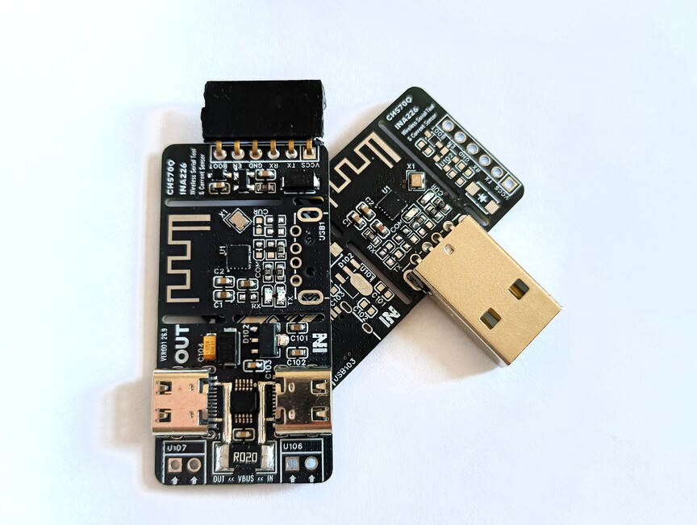
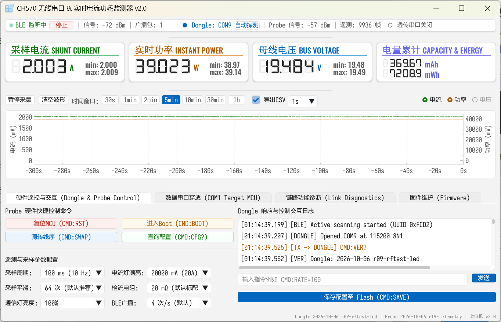
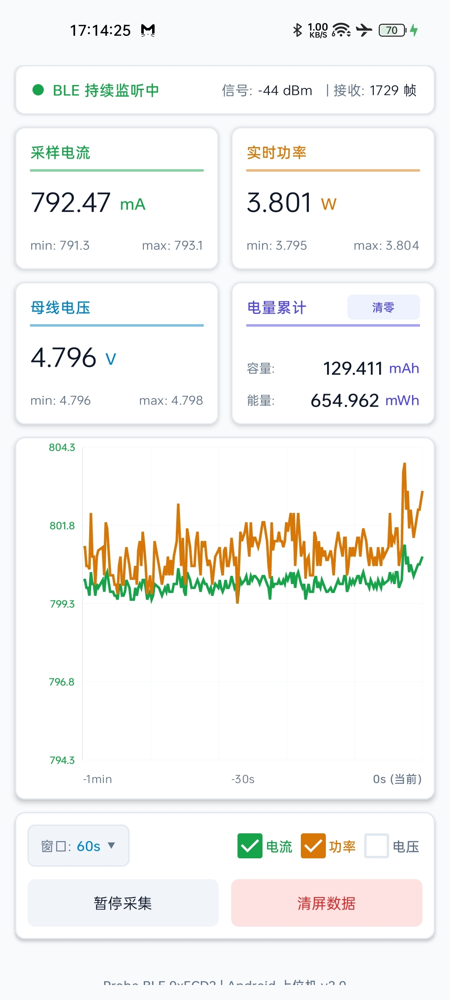

# CH570Q 无线串口调试与电流测量工具（带BLE广播）

> 参赛赛事：沁恒 RISC-V MCU 杯第 11 届立创电子设计大赛  
> 开源协议：OpenAtom OHL 1.0  
> 设计软件：嘉立创 EDA 专业版

## 1. 项目概述

本项目由一块 Probe 和一块 Dongle 组成，用于在 PC 与下游 MCU 之间建立无线串口连接。Probe 接在目标板一侧，Dongle 插在 PC 的 USB 口上。两块板之间使用 2.4 GHz 无线链路，PC 不需要把 USB 线拉到目标板旁边。

项目面向通用下游 MCU，不绑定某一款芯片。它可以完成：

- 双向串口透传，适合日志、命令行和在线调试；
- 通过目标板的 EN/RST 与 BOOT/GPIO0 控制线进行复位和进入下载模式；
- 配合常见烧录工具完成下游 MCU 固件烧录；
- 测量目标板的电压、电流和功率，并在上位机中显示曲线、统计值和 Ah/Wh；
- 目标板未连接 Dongle 时，通过 BLE低功耗蓝牙 广播发送电流测量数据，可通过上位机或配套安卓APP查看；
- 在软件上交换目标 UART 的 TX/RX 映射，不需要手动拔插硬件；
- 进行 Dongle 自身固件更新、Probe 无线 OTA 和物理 ISP 恢复；
- 通过上位机测试无线链路的有效速率、往返延迟和 RSSI。

Dongle设备提供两个 USB 虚拟串口：

- **COM1：数据透传串口**。连接到目标 MCU 的 UART，所有收到的数据都会透传到无线侧，适用于串口终端和烧录工具。
- **COM2：控制与测量串口**。用于查看测量结果、设备状态、版本和升级进度，也用于发送控制命令。

## 2. 硬件连接

1. Dongle 插入电脑的 USB 口。链路指示灯会闪烁，PC上会新增两个虚拟串口。
2. Probe 通过Type-C的VBUS_IN取电（支持5~36V供电）或者通过VCCS 3.3V供电。
3. 如有测量功耗需要，VBUS_OUT接负载供电；
4. 如有串口通信需要，RX TX对接下游MCU的TX RX 以及注意GND引脚共地；如有复位和下载模式控制需要，可额外连接EN 和 BOOT到下游MCU。
6. 启动上位机，编号小的COM 用于透传串口数据，编号大的COM 用于测量和控制。

**Probe 上电时，RX 指示灯会常亮约 3 秒，表示正在完成初始化**。初始化完成后才开始接收目标 UART 数据；这段时间目标板不会因为 Probe 的初始化字节而收到串口透传数据。初始化完成之后RX TX指示灯跟随串口透传数据情况闪烁

**Dongle 未连接Probe时 通信链路指示灯快闪，连接成功后以呼吸灯形式缓慢闪烁**。当透传串口上传输数据量大时，呼吸频率加快。

> - **C TO C 类型的Type-C供电线一般需要接入负载VBUS上才会有电压**;
> - **若供电采样的输入输出都连接的是C TO C线缆，接口上的CC引脚会具有方向性，如果插上去发现没有上电，可以尝试翻转其中一个Type-C接头**。
>  - 由于C TO C线一般需要接入负载VBUS上才会有电压，如果需要测量负载从上电瞬间的电流变化，建议先通过VCCS 3.3V给Probe供电，Probe启动后接入负载，VBUS_IN和VCCS已经使用肖特基二极管做了防倒灌保护。
> - 实测15米直线无遮挡情况下Dongle与Probe能够正常建立连接；在穿透一堵20cm厚度空心砖墙情况下直线距离4m可正常建立连接。
> - 正常通过VBUS_IN>>VBUS_OUT给负载供电，测量的就是负载端的电压电流，不涉及Probe板子自身耗电。如果反过来连接则可以测得Probe板子本身的功耗，实测约为 5.1V 16mA;

## 3. 串口收发

### 3.1 普通串口调试

在上位机或者常规串口工具里面选择 数据透传串口COM 和目标波特率后打开串口，即可像使用 USB-TTL 线一样收发数据。

如果 TX/RX 接线方向相反，可以在控制页执行 调转线序命令（CMD:SWAP命令），保存后重新打开 透传串口。

### 3.2 下游 MCU 烧录

烧录工具中选择 Dongle 的透传串口。Dongle会自动识别DTR/RTS控制流，把目标板的 BOOT 和 EN/RST 控制为相应状态并正常执行烧录。

> 目前仅在PC上测试过ESP-TOOL烧录有效，测试通过的最高波特率为460800，烧录1.3MB左右的固件耗时大约32s。

## 4. 电流功耗测量

启动上位机并建立连接后，会持续更新：

- 电压、电流、功率的当前值和一段时间窗口内的数据变化曲线；
- 选中绘图时间窗口内的最小值、最大值；
- Ah 与 Wh 累计值；

采样配置、上报周期、分流电阻、平均次数、电流满量程和 BLE 广播频率都可以在控制页修改。上位机会把配置发送给 Dongle，Dongle 同步到 Probe；两端重新上电后仍使用保存的配置。默认每秒采样上报10次。

上位机的曲线窗口支持 `30s`、`1min`、`2min`、`5min`、`10min`、`30min`、`1h`、`2h` 和 `4h`。最近 15 分钟保留原始采样，超过 15 分钟的历史压缩为每秒一个趋势点；Ah/Wh 和统计值仍按每个收到的样本计算。CSV 按用户选择的导出周期写入，不受曲线显示抽样影响。

> 实际运行发现采样结果存在约1LSB即0.125mA的零漂，测量19V，2A电流过程运行正常。

## 5. BLE 广播

当 Probe 没有与 Dongle 建立无线连接时，会自动进入 BLE 非连接广播状态，发送电流采样结果；建立连接后停止广播。默认广播频率为 4 Hz，也可以通过配置修改为 1~20 Hz。

> WIN端的蓝牙扫描频率受限，上位机可能看到数据1~3秒才刷新一次。安卓APP端更新频率会高一些。

- 广播类型：`ADV_NONCONN_IND`，不配对、不连接、不应答、不重传；
- 广播地址：`CA:57:09:1E:A2:26`；
- 广播信道：BLE 37、38、39；
- PHY：BLE 1M；
- Service Data UUID：`0xFCD2`，空中小端字节序为 `D2 FC`；
- Service Data 内容：4 字节小端打包值（低 17 位为有符号电流码、高 15 位为母线电压码）和滚动序号；
- 计算方式：电流为 `current_code × 0.125mA`，电压为 `bus_code × 1.25mV`，功率由扫描端计算，不需要知道采样电阻。

这是非连接广播，因此没有 GATT 服务/特征读写过程；`0xFCD2` 是扫描器用于识别 Service Data 的标识。BLE 广播只用于低功耗遥测，不承载透传串口数据。

## 6. 元件选择与焊接注意事项

- Dongle只需要焊接原理图上的核心区域以及位号为20x的元件；
- Probe只需要只需要焊接原理图上的核心区域以及位号为10x的元件；
- 注意背面还有元件；
- 不同颜色和厂家型号的LED的导通电压、发光强度不同，若更换元件选型，则限流电阻需要根据对应规格书来重新计算合适阻值，Probe上串口RX TX的指示灯若按当前LED选型和限流电阻，则日间观测光强度偏暗，可以适当考虑减小限流电阻阻值。
- 1N4148WS用于导通下拉BOOT和隔离下游MCU按键行为。实测发现二极管压降使 BOOT 拉低后的残压已接近 ESP32 的低电平阈值，当前可正常工作但裕量较小。**下一版可评估换用 BAT54WS**：其具有更低的正向压降，能加强下拉水平，且与 1N4148WS 同为 SOD-323、阴极在 pin 1、阳极在 pin 2，可直接替换。
- MAX811S主要利用GPIO触发其延迟复位功能，不使用其掉电复位功能。测试发现芯片供电经过 SS14 压降后仅约为 3.033V，虽未误触发掉电复位，但与 MAX811S 的 `2.857~3.003V` 阈值范围接近，裕量较小。**可评估同厂 MAX811R（C5379085）**替换现用 MAX811S（C5379084）：两者均为 SOT-143、低有效开漏输出、带 `MR#`、500ms 延迟，MAX811R 的阈值为 `2.63V±2.5%`，即约 `2.564~2.696V`，在 VCC=3.0V 时相对最高阈值仍有约 0.30V 裕量。
- INA226和TypeC引脚容易连锡，注意使用放大镜检查，连锡发生时可尝试涂抹少量助焊剂，再用干净的电烙铁刀头充分接触吸走连锡的部分；CH570Q引脚容易连锡，可在加热台上用镊子划过一排引脚以推走多余锡珠。

## 7. 固件烧录

### 7.1 Dongle 首次烧录

新焊接好的空片直接通过 USB 公头连接 PC，使用 WCHISPTool 选择 USB 下载 Dongle 固件即可。

### 7.2 Probe 首次烧录

Probe并不会焊接USB公头，但其实首次烧录可以用个USB-A公头插在未焊接的引脚焊孔并靠紧，像Dongle那样插入电脑烧录，只不过这样做连接不太可靠，比较考验功夫。

方案 A：临时接 USB 线以 USB ISP 烧录
由于 CH570Q 的 PA0 就是 USB D-，PA1 就是 USB D+，找一根旧 USB 数据线破线临时杜邦线连接：

- USB 白线（D-） ➔ 接 排针  (TXD / PA0)
- USB 绿线（D+） ➔ 接 排针  (RXD / PA1)
- USB 黑线（GND） ➔ 接 排针 (GND)

板子由 Type-C 口的VBUS供电或者 VCCS的3.3V正常供电。

插上电脑后，WCHISPTool 的 USB 模式即可直接识别下载。

方案 B：使用普通 USB-TTL 串口小板烧录
如果有 CH340 / CP2102 等常规串口工具：

- 串口模块 RXD ➔ 接 (TXD / PA0)
- 串口模块 TXD ➔ 接 (RXD / PA1)
- 串口模块 GND ➔ 接 (GND)
- 串口模块 VCC ➔ 先不接 (VCCS)

打开 WCHISPTool，下载方式选择【串口】，选择CH340对应的 COM 口，选好固件hex，点击开始烧录，然后再接入VCCS，上电时候设备会被捕获识别，会自动开始烧录。

### 7.3 Dongle 再次烧录

方案 C：在上位机的固件维护页面点击“Dongle固件下发”按钮，选择HEX文件烧录即可；

方案D：在上位机的固件维护页面点击“Dongle 进入ISP”按钮，这会擦除Flash并复位到 WCH ISP，两个虚拟串口会消失。随后重新拔插一次 USB，打开WCHISPTool软件，选择 USB 模式即可直接识别下载。

方案E：使用普通 USB-TTL 串口小板烧录

如果有 CH340 / CP2102 等常规串口工具：

注意USB A口不要连接电脑

- 串口模块 RXD ➔ 接 (TXD / PA0)
- 串口模块 TXD ➔ 接 (RXD / PA1)
- 串口模块 GND ➔ 接 (GND)
- 串口模块 +5V ➔ 先不接 USB接口(5V 引脚)

打开 WCHISPTool，下载方式选择【串口】，选择CH340对应的 COM 口，选好固件hex，点击开始烧录，然后用杜邦线连接一下5V引脚，上电时候设备会被捕获识别，会自动开始烧录。

### 7.4 Probe 再次烧录

方案 F：在上位机的固件维护页面点击“Probe OTA”按钮，选择HEX文件烧录即可；

或者参考方案B

## 8. 设计文档指引

[单引脚实现复位与进入下载模式原理](./复位与烧录引脚原理.md)

[控制与遥测串口交互协议](./控制与遥测串口交互协议.md)

[固件详细设计](./固件详细设计.md)

[上位机详细设计](./上位机详细设计.md)

## 9. 配套软件

https://github.com/siuze/ch570_ina226/releases